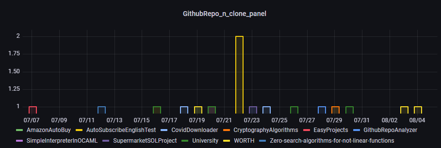

# GithubRepoAnalyzer
GithubRepoAnalyzer is a script that analyze the views/clones of a github repository and saves them in JSON file.  
You can even visualize with a chart the views/clones of a specific directory.

## Files
### RepoAnalyzer
**RepoAnalyzer** file is the script used to analyze all the stats of the repository that are in the **_repo.json_** file.  
The stats are saved in the **_RepoData.json_** file.

### DisplayStats
**DisplayStats** file is the script used to visualize in a chart the stats of a specific repository (last 14 days).  
Example:  

### Menu
**Menu** file is the script used to use an interact menù.

### ConvertJsonSQL
**ConvertJsonSQL** file is used to convert the Json file into a MySQL DB

## Using GithubRepoAnalyzer
To use GithubRepoAnalyzer you need to:
1) Have python installed
2) Make a virtualenv: virtualenv "project"
3) Install the dependencies on the virtualenv: pip install -r requirements.txt

At this point you can add repo to the **_repo.json_** file manually or with the menù option.  
Fill the **_config.json_** file with the information needed -> You need to generate a **_githubAccessToken_** first!  
Then you can save the stats with the **_RepoAnalyzer_** script or display the stats saved with the **_DisplayStats_** script. 

## Configure data for Grafana Dashboard and Visualization
1) Configure your MySQL and create a DB for the GithubStats data, the name it's not important.
2) Configure the created DB tables
~~~~sql
CREATE TABLE `Repository` (
  `name` varchar(255) NOT NULL
) ENGINE=InnoDB DEFAULT CHARSET=utf8mb4;
~~~~

~~~~sql
CREATE TABLE `Clones` (
  `RepoName` varchar(255) NOT NULL,
  `clone_timestamp` timestamp NOT NULL DEFAULT current_timestamp() ON UPDATE current_timestamp(),
  `clone_n_uniques_users` int(11) NOT NULL,
  `n_clones` int(11) NOT NULL
) ENGINE=InnoDB DEFAULT CHARSET=utf8mb4;
~~~~

~~~~sql
CREATE TABLE `Views` (
  `RepoName` varchar(255) NOT NULL,
  `view_timestamp` timestamp NOT NULL DEFAULT current_timestamp() ON UPDATE current_timestamp(),
  `view_n_uniques_users` int(11) NOT NULL,
  `n_views` int(11) NOT NULL
) ENGINE=InnoDB DEFAULT CHARSET=utf8mb4;
~~~~

3) Configure "ConvertJsonSQL" file with the correct data:
    - Host = localhost or databaseHost
    - Database = DB name
    - User = Username
    - Password = User password
4) Run the Python file, now you should see the data in the Database
5) Install Grafana and open it, in localhost should be: localhost:3000
6) Configure Grafana (IMPORTANT: CREATE A NEW READ-ONLY DB USER AND USE IT FOR GRAFANA!)
    - Settings -> Add Data Source -> MySQL -> Give a name and fill the MySQL connection settings (WITH READ-ONLY USER DATA)
    - Go to "create" -> "add an empty panel" -> Select as Data source your DB -> Adjust the query as you want!
    - SAVE
7) Finish! Now you should see it in the "DashBoard" panel! 

DashboardExample
