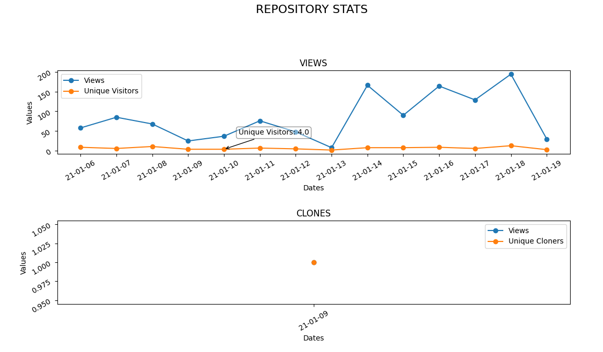

# GithubRepoAnalyzer
GithubRepoAnalyzer is a script that analyze the views/clones of a github repository and saves them in JSON file.  
You can even visualize with a chart the views/clones of a specific directory.

## Files
### RepoAnalyzer
**RepoAnalyzer** file is the script used to analyze all the stats of the repository that are in the **_repo.json_** file.  
The stats are saved in the **_RepoData.json_** file.

### DisplayStats
**DisplayStats** file is the script used to visualize in a chart the stats of a specific repository (last 14 days).  
Example:  

### Menu
**Menu** file is the script used to use an interact menù.

## Using GithubRepoAnalyzer
To use GithubRepoAnalyzer you need to:
1) Have python installed
2) Make a virtualenv: virtualenv "project"
3) Install the dependencies on the virtualenv: pip install -r requirements.txt

At this point you can add repo to the **_repo.json_** file manually or with the menù option.  
Fill the **_config.json_** file with the information needed -> You need to generate a **_githubAccessToken_** first!  
Then you can save the stats with the **_RepoAnalyzer_** script or display the stats saved with the **_DisplayStats_** script. 

